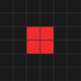
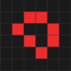
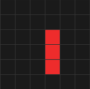
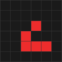

# Life for Two - User guide

## What is Life for Two?
Let's talk about what Conway's Game of Life is first. The universe of the Game of Life is an infinite two-dimensional grid of cells, each of which is in one of two possible states: *live* or *dead*.

The state of each cell is determined by its surrounding 8 neighbors, which are the cells that are horizontally, vertically, or diagonally adjacent:
	
 - Any *dead* cell will come alive if it has exactly 3 *live* neighbors.
 - Any *live* cell will stay alive if it has either 2 or 3 *live* neighbors.
 - Any *live* cell will become dead if it has neither 2 or 3 *live* neighbors.

It's a cellular automaton and also what's known as a 0-player game because its evolution is determined by its initial state, requiring no further input. 

### So what does Life for Two bring to the table?
Life for Two turns Conway's Game of Life from a 0-player game into a 2-player game. Now there are **RED** cells and **BLUE** cells to distinguish between the two players. 

 - Each *dead* cell that comes alive will be assigned its color based on which player had the majority of its *live* neighbours. 
 - Each *live* cell is affected only by neighbours of the same color. 

## Game Settings
After running *run.bat* you'll be presented with a window where you can specify settings for the game. 

 - Field Width and Field Height specify the dimensions of the grid. 
 - Edge Wrapping toggles whether or not the field should wrap around its edges.
 - Starting Cells lets you select how many cells both of the players start the game with.

## Choosing Starting Cells
After clicking "CONTINUE", both players will be able to choose their starting cells in an alternating fashion, starting with: **RED**.

When the last cell is selected a button saying: "PLAY" will pop up.

### How to choose your starting cells: 
It's best to start the game with one of the stable patterns in Game of Life, also known as still lifes, oscillators or spacechips:

## Gameplay 
After clicking the "PLAY" button, the grid will start to update in real time. 
Both players will be able to use power ups, which change the rules of the game for the player for a set number of iterations.

Here are the three implemented power ups: 
|        | Survive Rules    | Come Alive Rules  | Duration |  Cooldown |
|--------|------------------|-------------------|----------|-----------|
| Amoeba | 1, 3, 5, 8       | 3, 5, 7           | 3        | 15        |
| Gnarl  | 1                | 1                 | 2        | 20        |
| Explode| 2, 3, 5, 6, 7, 8 | 3, 7              | 3        | 30        |

Cooldowns on powerups as progress bars are going to be shown bellow the grid with their respective key-binds.

## End of the Game
When one of the players has no more *live* cells, the other player wins.

You can also press Esc to end the game, evaluate the position and choose the winner based on the current number of **RED** and **BLUE** cells in the field.
